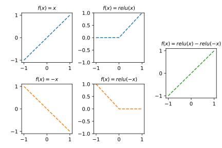

## 1. 꺾인 직선만 나올까?

아래와 같은 네트워크를 생각하자.

```python
net = torch.nn.Sequential(
    torch.nn.Linear(1, 2, bias=True),
    torch.nn.ReLU(),
    torch.nn.Linear(2, 1, bias=True),
    torch.nn.Sigmoid()
)
```

이 네트워크는 중간에 ReLU가 포함되어 있으므로 "**시그모이드 이전 값이 항상 꺾인 직선인 네트워크**"라고 흔히 오해된다. 즉 이 네트워크는 `torch.nn.Linear(1,1) → torch.nn.Sigmoid()`가 만드는 **꺾이지 않은 단순 S자 곡선(시그모이드 이전 값이 그냥 직선인 경우)** 은 출력할 수 없다고 주장하는 사람이 있다.

`(1)` 이 주장이 맞는지 틀린지 본인의 의견을 서술하시오.

::: {.callout-note collapse="true"}
## 풀이 보기

주장은 틀렸음. 이 네트워크는 꺾인선도 만들 수 있고, 꺾이지 않은 선도 만들 수 있음.
:::

`(2)` `(1)`에서 이 네트워크가 꺾이지 않은 직선도 시그모이드 이전 값으로 출력할 수 있다고 답했다면, 이를 **실제로 실현하는 가중치의 예시**를 하나 제시하시오. 구체적으로 `net[0].weight`, `net[0].bias`, `net[2].weight`, `net[2].bias`를 어떻게 설정해야 시그모이드 이전 값이 꺾이지 않은 직선이 되는지 적고, 왜 그러한 설정이 꺾이지 않은 직선을 만드는지 과정을 단계별로 서술하시오. 

::: {.callout-note collapse="true"}
## 풀이 보기

**정답 예시 (시그모이드 이전 값이 $x$ 가 되는 가중치):**

```python
# Linear(1,2): weight shape [2,1], bias shape [2]
net[0].weight.data = torch.tensor([[1.0], [-1.0]])
net[0].bias.data   = torch.tensor([0.0, 0.0])

# Linear(2,1): weight shape [1,2], bias shape [1]
net[2].weight.data = torch.tensor([[1.0, -1.0]])
net[2].bias.data   = torch.tensor([0.0])
```

**단계별 확인:**

입력 $x$ 를 각 단계에 통과시킨 모습은 아래와 같다.



:::

## 2. 네트워크의 한계와 True Structure

`(1)` 아래와 같이 참값이 매우 복잡한 곡선을 따르는 데이터가 있다고 하자.

$$y_i = e^{-x_i}\,|\cos(3x_i)|\,\sin(3x_i) + \epsilon_i, \qquad i = 1, 2, 3, \ldots, n$$

강의에서는 아래 네트워크로 이 곡선을 적합하였다.

```python
net = torch.nn.Sequential(
    torch.nn.Linear(1, 512),
    torch.nn.ReLU(),
    torch.nn.Linear(512, 1)
)
```


::: {.callout-note collapse="true"}
## 풀이 보기

데이터의 숫자와 네트워크의 표현력은 관련이 없다. 이 네트워크가 표현할 수 있는 형태는 꺾인 직선이므로, 곡선형태를 표현할 수 없다. 

:::

`(2)` `(1)`에서 보았듯이, 데이터 수 $n$을 무한히 키우는 것만으로는 네트워크의 적합 결과가 참 구조에 정확히 가까워지지 않는다. 그렇다면 네트워크의 적합 결과가 참 구조에 점점 가까워지게 하기 위해서는 **무엇을 늘려야 하는지** 서술하시오.

::: {.callout-note collapse="true"}
## 풀이 보기

아래의 코드에서 512를 점점 더 키우면 점점 더 곡선에 가까워진다. 

```python
net = torch.nn.Sequential(
    torch.nn.Linear(1, 512),
    torch.nn.ReLU(),
    torch.nn.Linear(512, 1)
)
```
:::
