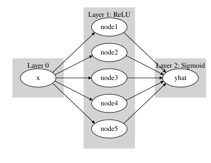
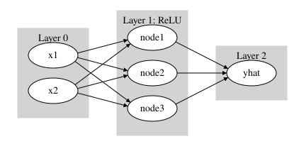
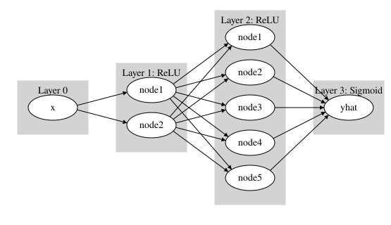

## 1. 다이어그램에 대응하는 네트워크 만들기

아래 각 노드 다이어그램에 대응하는 `torch.nn.Sequential(...)` 코드를 작성하시오.

`(1)` 입력 ${\bf X}$ 의 shape 은 $(n, 1)$, 출력 $\hat{\bf Y}$ 의 shape 은 $(n, 1)$ 이다.

`(2)` 입력 ${\bf X}$ 의 shape 은 $(n, 2)$, 출력 $\hat{\bf Y}$ 의 shape 은 $(n, 1)$ 이다.

`(3)` 입력 ${\bf X}$ 의 shape 은 $(n, 1)$, 출력 $\hat{\bf Y}$ 의 shape 은 $(n, 1)$ 이다.

## 2. 레이어/노드

1번에서 나온 세 네트워크 `1-(1)`, `1-(2)`, `1-(3)` 에 대해 각각의 **은닉층 수**와 **각 은닉층의 노드 수**를 적으시오.
