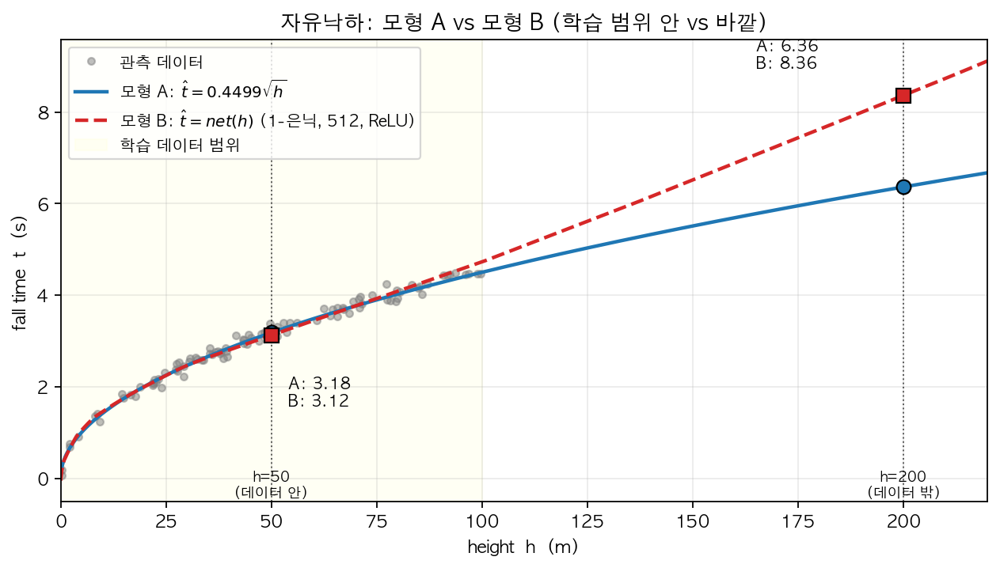

## 1. 단순 로지스틱의 표현력: 8가지 데이터

다음 네트워크 (은닉층 없음, 단순 로지스틱) 를 고려하자.

```python
torch.nn.Sequential(
    torch.nn.Linear(2, 1),
    torch.nn.Sigmoid()
)
```

이 네트워크가 표현하는 함수는

$$\hat{y} = \text{sig}(w_0 + w_1 x_1 + w_2 x_2)$$

이다. 여기서 $w_0$ 는 bias, $w_1, w_2$ 는 가중치이다.

이제 입력이 $x_1, x_2 \in \{-1, 0, 1\}$ 인 9개의 점에 대해 $y \in \{0, 1\}$ 이 정의되는 다음 8가지 데이터 ($D_1$ ~ $D_8$) 의 진리표를 모두 나열한 것이다.

:::: {.columns}

::: {.column width="24%"}
::: {.callout-note appearance="simple" icon=false}
**$D_1$**

| ${\bf x}_1$ | ${\bf x}_2$ | ${\bf y}$ |
|:---:|:---:|:---:|
| -1 | -1 | 0 |
| -1 | 0 | 0 |
| -1 | 1 | 0 |
| 0 | -1 | 0 |
| 0 | 0 | 0 |
| 0 | 1 | 0 |
| 1 | -1 | 0 |
| 1 | 0 | 0 |
| 1 | 1 | 0 |
:::
:::

::: {.column width="1%"}
:::

::: {.column width="24%"}
::: {.callout-note appearance="simple" icon=false}
**$D_2$**

| ${\bf x}_1$ | ${\bf x}_2$ | ${\bf y}$ |
|:---:|:---:|:---:|
| -1 | -1 | 1 |
| -1 | 0 | 1 |
| -1 | 1 | 1 |
| 0 | -1 | 1 |
| 0 | 0 | 1 |
| 0 | 1 | 1 |
| 1 | -1 | 1 |
| 1 | 0 | 1 |
| 1 | 1 | 1 |
:::
:::

::: {.column width="1%"}
:::

::: {.column width="24%"}
::: {.callout-note appearance="simple" icon=false}
**$D_3$**

| ${\bf x}_1$ | ${\bf x}_2$ | ${\bf y}$ |
|:---:|:---:|:---:|
| -1 | -1 | 0 |
| -1 | 0 | 0 |
| -1 | 1 | 0 |
| 0 | -1 | 0 |
| 0 | 0 | 0 |
| 0 | 1 | 0 |
| 1 | -1 | 1 |
| 1 | 0 | 1 |
| 1 | 1 | 1 |
:::
:::

::: {.column width="1%"}
:::

::: {.column width="24%"}
::: {.callout-note appearance="simple" icon=false}
**$D_4$**

| ${\bf x}_1$ | ${\bf x}_2$ | ${\bf y}$ |
|:---:|:---:|:---:|
| -1 | -1 | 1 |
| -1 | 0 | 0 |
| -1 | 1 | 0 |
| 0 | -1 | 1 |
| 0 | 0 | 0 |
| 0 | 1 | 0 |
| 1 | -1 | 1 |
| 1 | 0 | 0 |
| 1 | 1 | 0 |
:::
:::

::::

:::: {.columns}

::: {.column width="24%"}
::: {.callout-note appearance="simple" icon=false}
**$D_5$**

| ${\bf x}_1$ | ${\bf x}_2$ | ${\bf y}$ |
|:---:|:---:|:---:|
| -1 | -1 | 0 |
| -1 | 0 | 0 |
| -1 | 1 | 0 |
| 0 | -1 | 0 |
| 0 | 0 | 0 |
| 0 | 1 | 1 |
| 1 | -1 | 0 |
| 1 | 0 | 1 |
| 1 | 1 | 1 |
:::
:::

::: {.column width="1%"}
:::

::: {.column width="24%"}
::: {.callout-note appearance="simple" icon=false}
**$D_6$**

| ${\bf x}_1$ | ${\bf x}_2$ | ${\bf y}$ |
|:---:|:---:|:---:|
| -1 | -1 | 0 |
| -1 | 0 | 0 |
| -1 | 1 | 0 |
| 0 | -1 | 1 |
| 0 | 0 | 0 |
| 0 | 1 | 0 |
| 1 | -1 | 1 |
| 1 | 0 | 1 |
| 1 | 1 | 0 |
:::
:::

::: {.column width="1%"}
:::

::: {.column width="24%"}
::: {.callout-note appearance="simple" icon=false}
**$D_7$**

| ${\bf x}_1$ | ${\bf x}_2$ | ${\bf y}$ |
|:---:|:---:|:---:|
| -1 | -1 | 0 |
| -1 | 0 | 0 |
| -1 | 1 | 1 |
| 0 | -1 | 0 |
| 0 | 0 | 0 |
| 0 | 1 | 0 |
| 1 | -1 | 1 |
| 1 | 0 | 0 |
| 1 | 1 | 0 |
:::
:::

::: {.column width="1%"}
:::

::: {.column width="24%"}
::: {.callout-note appearance="simple" icon=false}
**$D_8$**

| ${\bf x}_1$ | ${\bf x}_2$ | ${\bf y}$ |
|:---:|:---:|:---:|
| -1 | -1 | 1 |
| -1 | 0 | 0 |
| -1 | 1 | 1 |
| 0 | -1 | 0 |
| 0 | 0 | 0 |
| 0 | 1 | 0 |
| 1 | -1 | 1 |
| 1 | 0 | 0 |
| 1 | 1 | 1 |
:::
:::

::::

8가지 데이터를 다음 4가지 **구조** 로 분류하시오.

> **참고 — "단조 (monotonic)" 의 뜻**: 한 변수가 증가할 때 다른 변수가 **한 방향으로만** 변하는 관계. 즉 계속 증가만 하거나 (단조 증가), 계속 감소만 함 (단조 감소). 중간에 방향이 뒤집히지 않음. 예: $y = 2x$ 는 단조 증가, $y = -x + 1$ 은 단조 감소, $y = x^2$ 는 단조가 아님 (감소했다가 증가).

- **(가) 상수:** $y$ 가 항상 0 또는 항상 1 (입력과 무관)
- **(나) 한 입력에 대한 단조:** $y$ 가 $x_1$ 또는 $x_2$ 한 변수에 대해서만 단조로 결정됨 (다른 한 변수는 영향없음)
- **(다) 두 입력 모두에 대한 단조:** 두 입력 모두 $y$ 에 영향을 주며, 각각 단조 관계를 유지
- **(라) 설명불가:** 단조 관계로는 설명할 수 없는 구조

(가) - (라) 중 은닉층이 없는 네트워크로 설명불가능한 경우는 무엇인가? 

::: {.callout-note collapse="true"}
## 풀이 보기

| 구조 | 해당 데이터 |
|:---|:---|
| **(가) 상수** | $D_1$, $D_2$ |
| **(나) 한 입력에 대한 단조** | $D_3$, $D_4$ |
| **(다) 두 입력 모두에 대한 단조** | $D_5$, $D_6$ |
| **(라) 설명불가** | **$D_7$, $D_8$** |

**각 입력 값을 고정했을 때의 $y$ 평균 trend** — 예를 들어 "$x_1{=}{-}1$ 의 $\bar{y}$" 는 $x_1$ 을 $-1$ 로 고정한 채 $x_2$ 를 $-1, 0, 1$ 로 바꾼 3개 점의 $y$ 평균.

```{=html}
<style>
.trend-outer { width: 100%; border-collapse: collapse; }
.trend-outer > thead > tr > th,
.trend-outer > tbody > tr > td { border: 1px solid #ddd; padding: 6px; vertical-align: middle; text-align: center; }
.trend-inner { width: 100%; border-collapse: collapse; margin: 0; }
.trend-inner th, .trend-inner td { border: 1px solid #eee; padding: 4px 6px; font-size: 0.9em; text-align: center; }
.trend-inner th { background: #f7f7f7; font-weight: normal; }
</style>

<table class="trend-outer">
<thead>
<tr>
  <th>#</th>
  <th>\(x_1\) 에 따른 \(\bar{y}\)</th>
  <th>\(x_2\) 에 따른 \(\bar{y}\)</th>
  <th>분류</th>
</tr>
</thead>
<tbody>
<tr>
  <td>\(D_1\)</td>
  <td><table class="trend-inner"><tr><th>\(x_1\)</th><td>\(-1\)</td><td>\(0\)</td><td>\(1\)</td></tr><tr><th>\(\bar{y}\)</th><td>\(0\)</td><td>\(0\)</td><td>\(0\)</td></tr></table></td>
  <td><table class="trend-inner"><tr><th>\(x_2\)</th><td>\(-1\)</td><td>\(0\)</td><td>\(1\)</td></tr><tr><th>\(\bar{y}\)</th><td>\(0\)</td><td>\(0\)</td><td>\(0\)</td></tr></table></td>
  <td style="text-align:left;line-height:1.6"><div>\(x_1\) 효과: <b>상수</b></div><div>\(x_2\) 효과: <b>상수</b></div><div style="margin-top:4px;color:#0066cc">→ 분류: <b>(가)</b></div></td>
</tr>
<tr>
  <td>\(D_2\)</td>
  <td><table class="trend-inner"><tr><th>\(x_1\)</th><td>\(-1\)</td><td>\(0\)</td><td>\(1\)</td></tr><tr><th>\(\bar{y}\)</th><td>\(1\)</td><td>\(1\)</td><td>\(1\)</td></tr></table></td>
  <td><table class="trend-inner"><tr><th>\(x_2\)</th><td>\(-1\)</td><td>\(0\)</td><td>\(1\)</td></tr><tr><th>\(\bar{y}\)</th><td>\(1\)</td><td>\(1\)</td><td>\(1\)</td></tr></table></td>
  <td style="text-align:left;line-height:1.6"><div>\(x_1\) 효과: <b>상수</b></div><div>\(x_2\) 효과: <b>상수</b></div><div style="margin-top:4px;color:#0066cc">→ 분류: <b>(가)</b></div></td>
</tr>
<tr>
  <td>\(D_3\)</td>
  <td><table class="trend-inner"><tr><th>\(x_1\)</th><td>\(-1\)</td><td>\(0\)</td><td>\(1\)</td></tr><tr><th>\(\bar{y}\)</th><td>\(0\)</td><td>\(0\)</td><td>\(1\)</td></tr></table></td>
  <td><table class="trend-inner"><tr><th>\(x_2\)</th><td>\(-1\)</td><td>\(0\)</td><td>\(1\)</td></tr><tr><th>\(\bar{y}\)</th><td>\(1/3\)</td><td>\(1/3\)</td><td>\(1/3\)</td></tr></table></td>
  <td style="text-align:left;line-height:1.6"><div>\(x_1\) 효과: <b>단조 ↑</b></div><div>\(x_2\) 효과: <b>상수</b></div><div style="margin-top:4px;color:#0066cc">→ 분류: <b>(나)</b></div></td>
</tr>
<tr>
  <td>\(D_4\)</td>
  <td><table class="trend-inner"><tr><th>\(x_1\)</th><td>\(-1\)</td><td>\(0\)</td><td>\(1\)</td></tr><tr><th>\(\bar{y}\)</th><td>\(1/3\)</td><td>\(1/3\)</td><td>\(1/3\)</td></tr></table></td>
  <td><table class="trend-inner"><tr><th>\(x_2\)</th><td>\(-1\)</td><td>\(0\)</td><td>\(1\)</td></tr><tr><th>\(\bar{y}\)</th><td>\(1\)</td><td>\(0\)</td><td>\(0\)</td></tr></table></td>
  <td style="text-align:left;line-height:1.6"><div>\(x_1\) 효과: <b>상수</b></div><div>\(x_2\) 효과: <b>단조 ↓</b></div><div style="margin-top:4px;color:#0066cc">→ 분류: <b>(나)</b></div></td>
</tr>
<tr>
  <td>\(D_5\)</td>
  <td><table class="trend-inner"><tr><th>\(x_1\)</th><td>\(-1\)</td><td>\(0\)</td><td>\(1\)</td></tr><tr><th>\(\bar{y}\)</th><td>\(0\)</td><td>\(1/3\)</td><td>\(2/3\)</td></tr></table></td>
  <td><table class="trend-inner"><tr><th>\(x_2\)</th><td>\(-1\)</td><td>\(0\)</td><td>\(1\)</td></tr><tr><th>\(\bar{y}\)</th><td>\(0\)</td><td>\(1/3\)</td><td>\(2/3\)</td></tr></table></td>
  <td style="text-align:left;line-height:1.6"><div>\(x_1\) 효과: <b>단조 ↑</b></div><div>\(x_2\) 효과: <b>단조 ↑</b></div><div style="margin-top:4px;color:#0066cc">→ 분류: <b>(다)</b></div></td>
</tr>
<tr>
  <td>\(D_6\)</td>
  <td><table class="trend-inner"><tr><th>\(x_1\)</th><td>\(-1\)</td><td>\(0\)</td><td>\(1\)</td></tr><tr><th>\(\bar{y}\)</th><td>\(0\)</td><td>\(1/3\)</td><td>\(2/3\)</td></tr></table></td>
  <td><table class="trend-inner"><tr><th>\(x_2\)</th><td>\(-1\)</td><td>\(0\)</td><td>\(1\)</td></tr><tr><th>\(\bar{y}\)</th><td>\(2/3\)</td><td>\(1/3\)</td><td>\(0\)</td></tr></table></td>
  <td style="text-align:left;line-height:1.6"><div>\(x_1\) 효과: <b>단조 ↑</b></div><div>\(x_2\) 효과: <b>단조 ↓</b></div><div style="margin-top:4px;color:#0066cc">→ 분류: <b>(다)</b></div></td>
</tr>
<tr>
  <td>\(D_7\)</td>
  <td><table class="trend-inner"><tr><th>\(x_1\)</th><td>\(-1\)</td><td>\(0\)</td><td>\(1\)</td></tr><tr><th>\(\bar{y}\)</th><td>\(1/3\)</td><td>\(0\)</td><td>\(1/3\)</td></tr></table></td>
  <td><table class="trend-inner"><tr><th>\(x_2\)</th><td>\(-1\)</td><td>\(0\)</td><td>\(1\)</td></tr><tr><th>\(\bar{y}\)</th><td>\(1/3\)</td><td>\(0\)</td><td>\(1/3\)</td></tr></table></td>
  <td style="text-align:left;line-height:1.6"><div>\(x_1\) 효과: <b>설명불가</b></div><div>\(x_2\) 효과: <b>설명불가</b></div><div style="margin-top:4px;color:#0066cc">→ 분류: <b>(라)</b></div></td>
</tr>
<tr>
  <td>\(D_8\)</td>
  <td><table class="trend-inner"><tr><th>\(x_1\)</th><td>\(-1\)</td><td>\(0\)</td><td>\(1\)</td></tr><tr><th>\(\bar{y}\)</th><td>\(2/3\)</td><td>\(0\)</td><td>\(2/3\)</td></tr></table></td>
  <td><table class="trend-inner"><tr><th>\(x_2\)</th><td>\(-1\)</td><td>\(0\)</td><td>\(1\)</td></tr><tr><th>\(\bar{y}\)</th><td>\(2/3\)</td><td>\(0\)</td><td>\(2/3\)</td></tr></table></td>
  <td style="text-align:left;line-height:1.6"><div>\(x_1\) 효과: <b>설명불가</b></div><div>\(x_2\) 효과: <b>설명불가</b></div><div style="margin-top:4px;color:#0066cc">→ 분류: <b>(라)</b></div></td>
</tr>
</tbody>
</table>
```

4가지 구조 중 (라)는 스펙의 역설처럼 $x_1 \to y$ , $x_2 \to y$의 규칙이 증가/감소가 아니라 꺽인선형태이다. 이러한 구조는 은닉층이 없는 네트워크로 적합할 수 없음. 

:::


## 2. 도메인 지식, 시벤코, 그리고 "모든 모형은 틀렸다"

강의노트의 자유낙하 문제에서 우리는 두 가지 방식의 모형을 얻었다.

- **모형 A (전통적 모델링):** 물리학 분야의 도메인 지식을 바탕으로 $t \propto \sqrt{h}$ 라는 관계식을 가정하고, 이로부터 $\hat{t}_i = \hat{w} \cdot \sqrt{h_i}$ 의 형태로 적합하였다 (적합 결과 $\hat{w} \approx 0.4499$).
- **모형 B (딥러닝식 모델링):** 참모델에 대한 사전 가정 없이, 표현력이 충분히 큰 네트워크 (1-은닉층, 노드 512, ReLU) 를 사용하여 $\hat{t}_i = net(h_i)$ 의 형태로 적합하였다.

:::: {.columns}

::: {.column width="49%"}
**모형 A:** $\hat{t} = \hat{w}\sqrt{h}$


:::

::: {.column width="2%"}
:::

::: {.column width="49%"}
**모형 B:** $\hat{t} = net(h)$


:::

::::

강의노트에 따르면 두 모형은 새로운 입력 $h=50$ 에 대해 서로 비슷한 예측값을 내놓았다.

다음은 위 두 모형과 George Box 의 명언

> "All models are wrong, but some are useful."

을 주제로 학생들이 나눈 심도있는 토론이다.

- **재현:** "근데 두 모형이 $h=50$ 에서 정확히 같은 값을 안 내는 건 좀 이상하지 않아? 물리적으로 정답은 하나일 거 아니야. 그렇다면 둘 중 적어도 하나는 틀린 거고, 어쩌면 둘 다 틀렸을 수도 있어."

- **성재:** "재현이 말이 일리 있어. '둘 다 틀렸다' — 이게 사실 Box 가 말한 'all models are wrong' 이랑 정확히 같은 얘기잖아. 두 모형이 다른 답을 낸다는 사실 자체가 둘 다 wrong 이라는 증거고, Box 도 결국 그런 의미로 한 말이지. 그러니까 재현이의 결론이 Box 의 메시지랑 딱 맞아떨어진 거야."

- **슬기:** "잠깐, 그건 Box 의 뉘앙스를 잘못 이해한 거야. Box 가 'all models are wrong' 이라고 한 건 어떤 모형이든 현실을 단순화·이상화한 근사이기 때문에 본질적으로 wrong 이라는 뜻이지. Box 의 핵심은 모형들 사이의 비교가 아니라, **모형을 바라보고 평가하는 기준 자체를 'true vs wrong' 이 아닌 '쓸모있음 vs 쓸모없음 (useful vs useless)' 의 관점에서 가져가야 한다는 점**을 역설하는 거야. '서로 다른 예측 → 적어도 하나 틀렸다' 라는 비교 기준이 아니라고. 두 모형이 같은 값을 냈더라도 둘 다 여전히 useless 일 수 있고, 두 모델이 다른 값을 냈지만 두 모델 모두 useful일 수 있어."

- **희석:** "근데 시벤코의 정리는 1-은닉층 네트워크가 충분한 노드만 있으면 어떤 함수든 표현할 수 있다고 했잖아. 그렇다면 모형 B 도 데이터 뒤에 깔려 있는 **underlying 함수 자체** — 즉 $\sqrt{\cdot}$ 형태 — 를 그대로 **식별** 해서 학습한다고 봐야 하는 거 아니야? 모형 B 가 $h=50$ 에서 모형 A 와 거의 같은 답을 낸 게 바로 그 증거고."

- **은희:** "그건 아니야. 모형 B 는 $\sqrt{\cdot}$ 형태를 학습한 게 아니라, **주어진 데이터 위에서 모형 A 와 거의 비슷한 출력을 내는 어떤 함수 하나를 찾은 것** 일 뿐이지. 두 모형이 $h=50$ 에서 비슷한 값을 낸 것도 그 한 점에서 두 함수가 우연히 가까웠다는 의미일 뿐, 모형 B 가 $\sqrt{\cdot}$ 형태를 학습했다는 증거는 되지 않아. 예를 들어 학습 데이터 범위 바깥인 $h=200$ 같은 곳에서는 두 모형의 예측이 꽤 달라질 수 있어. 모형 A 는 **$\sqrt{\cdot}$ 곡선** 을 그대로 따라가며 값을 내지만, 모형 B 는 본질적으로 ReLU 기반의 **꺾인선** 함수라서, 학습 데이터 끝 구간에서 학습된 **마지막 직선 조각** 이 그대로 이어지는 형태로 값을 내거든. 아래는 내가 실제로 두 모형을 적합해서 그려본 결과야."

    

    "보다시피 학습 데이터 범위 (노란색 구간) 안에서는 두 모형이 거의 일치하지만, 범위 바깥 $h=200$ 에서는 모형 A 는 약 6.36, 모형 B 는 약 8.36 으로 두 모형의 예측에 꽤 차이가 나. 결국 시벤코는 **근사 능력** 의 보장이지 **함수 형태 식별** 능력의 보장은 아니라는 게 핵심이야."

- **세민:** "한 가지만 덧붙이자면, 두 모형의 **비용** 도 꽤 다르다는 점은 짚고 가야 할 것 같아. 모형 A 는 업데이트할 파라메터가 단 **1개** ($\hat{w}$) 야. 대신 그 $\sqrt{\cdot}$ 라는 형태 자체를 알아내려면 물리학 도메인 전문가의 자문이 필요했지. 반대로 모형 B 는 도메인 지식 없이 데이터만으로 적합되지만, 업데이트할 파라메터가 약 **1,500개** ($1\times 512 + 512 + 512\times 1 + 1 = 1537$) 라서 연산비용이 훨씬 커. 둘 다 useful 이더라도 실제로는 **'도메인 지식 비용 vs 모형 복잡도 비용'** 의 trade-off 가 깔려 있는 셈이지."

위 토론에서 강의노트와 George Box 의 입장에 비추어 **틀린 주장** 을 한 학생을 **모두 고르시오**. 

::: {.callout-note collapse="true"}
## 풀이 보기

**정답:** 재현, 성재, 희석.

:::
