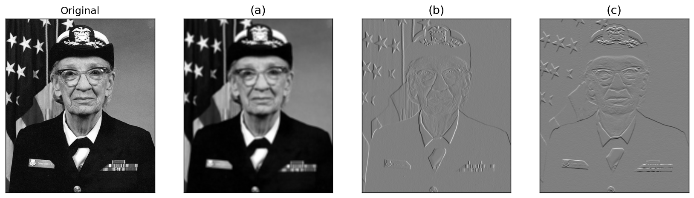

## 1. 어떤 필터를 썼을까?

하나의 흑백이미지(원본)에 대하여 아래 세 개의 `8x8` `Conv2d` 필터를 각각 적용하였다.

```python
# 1) vertical edge
V = torch.tensor([[[
  [ 0,  0,  0,  0,  0,  0,  0,  0],
  [ 0,  0,  0,  0,  0,  0,  0,  0],
  [ 0,  0,  1,  1, -1, -1,  0,  0],
  [ 0,  0,  1,  1, -1, -1,  0,  0],
  [ 0,  0,  1,  1, -1, -1,  0,  0],
  [ 0,  0,  1,  1, -1, -1,  0,  0],
  [ 0,  0,  0,  0,  0,  0,  0,  0],
  [ 0,  0,  0,  0,  0,  0,  0,  0]
]]]).float()

# 2) horizontal edge
H = torch.tensor([[[
  [ 0,  0,  0,  0,  0,  0,  0,  0],
  [ 0,  0,  0,  0,  0,  0,  0,  0],
  [ 0,  0, -1, -1, -1, -1,  0,  0],
  [ 0,  0, -1, -1, -1, -1,  0,  0],
  [ 0,  0,  1,  1,  1,  1,  0,  0],
  [ 0,  0,  1,  1,  1,  1,  0,  0],
  [ 0,  0,  0,  0,  0,  0,  0,  0],
  [ 0,  0,  0,  0,  0,  0,  0,  0]
]]]).float()

# 3) moving average (이동평균)
M = torch.tensor([[[
  [1/64, 1/64, 1/64, 1/64, 1/64, 1/64, 1/64, 1/64],
  [1/64, 1/64, 1/64, 1/64, 1/64, 1/64, 1/64, 1/64],
  [1/64, 1/64, 1/64, 1/64, 1/64, 1/64, 1/64, 1/64],
  [1/64, 1/64, 1/64, 1/64, 1/64, 1/64, 1/64, 1/64],
  [1/64, 1/64, 1/64, 1/64, 1/64, 1/64, 1/64, 1/64],
  [1/64, 1/64, 1/64, 1/64, 1/64, 1/64, 1/64, 1/64],
  [1/64, 1/64, 1/64, 1/64, 1/64, 1/64, 1/64, 1/64],
  [1/64, 1/64, 1/64, 1/64, 1/64, 1/64, 1/64, 1/64]
]]]).float()
```

세 필터를 적용한 결과가 아래 `(a)`, `(b)`, `(c)` 이다. (순서는 무작위로 섞여 있음)



`(a)`, `(b)`, `(c)` 각각이 위 세 필터 중 **어떤 필터를 적용한 결과인지** 짝지으시오. 그리고 그렇게 판단한 이유를 간단히 쓰시오.
