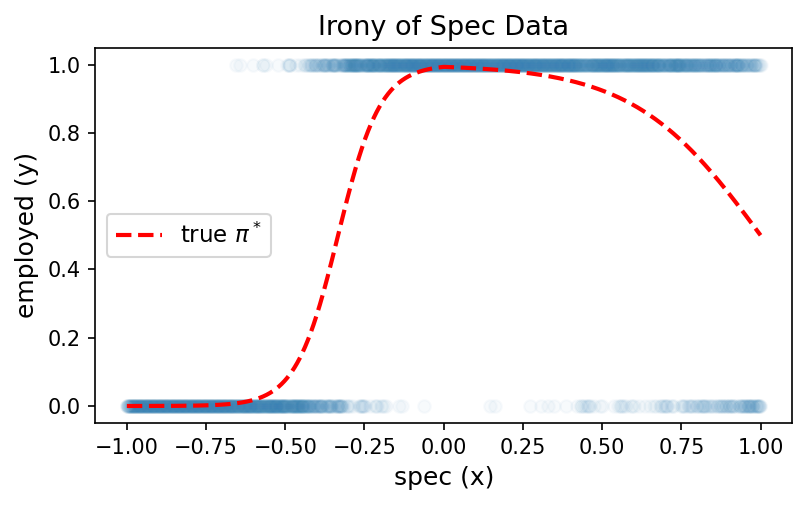
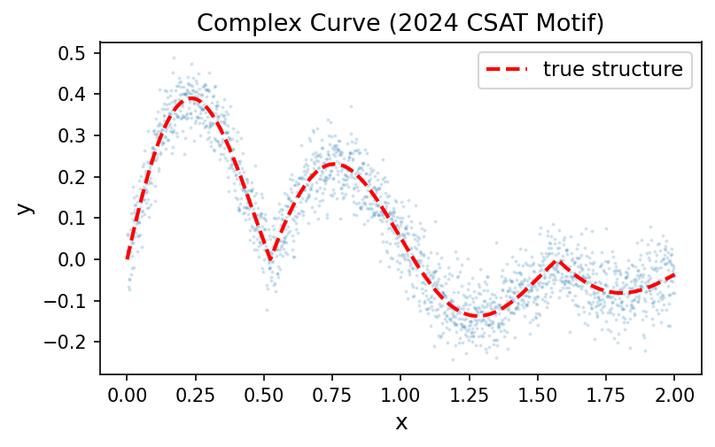

## 1. 꺾인 직선 만들기

`(1)` 다음 코드의 출력을 고르시오.

```python
relu = torch.nn.ReLU()
relu(torch.tensor(-3.0))
```

**(a)** `tensor(-3.0)`\
**(b)** `tensor(3.0)`\
**(c)** `tensor(0.0)`\
**(d)** `tensor(-1.0)`


`(2)` 다음 코드의 출력을 고르시오.

```python
relu = torch.nn.ReLU()
relu(torch.tensor(5.0))
```

**(a)** `tensor(0.0)`\
**(b)** `tensor(1.0)`\
**(c)** `tensor(-5.0)`\
**(d)** `tensor(5.0)`


`(3)` 벡터 $x = [-2,-1,0,1,2]$가 주어졌다고 하자. `torch.nn.Linear`를 이용하여 ${\bf X}$를 입력하면 첫 번째 열은 $x$, 두 번째 열은 $-x$가 되도록 만들고 싶다. 주석 부분에 들어갈 코드를 작성하시오.

$$
{\bf X} =
\begin{bmatrix}
x_1 \\
x_2 \\
x_3 \\
x_4 \\
x_5
\end{bmatrix}
=
\begin{bmatrix}
-2 \\
-1 \\
0 \\
1 \\
2
\end{bmatrix}
\quad \Longrightarrow \quad
{\bf U} =
\begin{bmatrix}
x_1 & -x_1 \\
x_2 & -x_2 \\
x_3 & -x_3 \\
x_4 & -x_4 \\
x_5 & -x_5
\end{bmatrix}
=
\begin{bmatrix}
-2 & 2 \\
-1 & 1 \\
0 & 0 \\
1 & -1 \\
2 & -2
\end{bmatrix}
$$

```python
x = torch.tensor([-2.0, -1.0, 0.0, 1.0, 2.0])
X = x.reshape(-1, 1)

###################
# 여기를 잘 채워주세요 #
###################

U = lin(X)
```


`(4)`

아래와 같이 ${\bf V}$가 $5 \times 2$ 행렬로 주어졌다고 하자.

$$
{\bf V}
=
\begin{bmatrix}
v_{11} & v_{12} \\
v_{21} & v_{22} \\
v_{31} & v_{32} \\
v_{41} & v_{42} \\
v_{51} & v_{52}
\end{bmatrix}
=
\begin{bmatrix}
1 & 2 \\
3 & 4 \\
5 & 6 \\
7 & 8 \\
9 & 10
\end{bmatrix}.
$$

이 행렬을 이용하여 각 행 $(v_1,v_2)$를 $2v_1 - 3v_2 + 1$로 바꾸고 싶다. 즉 아래와 같은 $5 \times 1$ 행렬 ${\bf Y}$를 만들고 싶다.

$$
{\bf Y}
=
\begin{bmatrix}
2v_{11}-3v_{12}+1 \\
2v_{21}-3v_{22}+1 \\
2v_{31}-3v_{32}+1 \\
2v_{41}-3v_{42}+1 \\
2v_{51}-3v_{52}+1
\end{bmatrix}
=
\begin{bmatrix}
2(1)-3(2)+1 \\
2(3)-3(4)+1 \\
2(5)-3(6)+1 \\
2(7)-3(8)+1 \\
2(9)-3(10)+1
\end{bmatrix}
=
\begin{bmatrix}
-3 \\
-5 \\
-7 \\
-9 \\
-11
\end{bmatrix}.
$$

주석 부분에 들어갈 코드를 작성하시오.

```python
V = torch.tensor([
    [1.0, 2.0],
    [3.0, 4.0],
    [5.0, 6.0],
    [7.0, 8.0],
    [9.0, 10.0]
])

###################
# 여기를 잘 채워주세요 #
###################

Y = lin(V)
```


## 2. 스펙의 역설

아래 그림은 스펙($x$)과 취업여부($y$)의 관계를 나타낸 데이터이다. 빨간 점선은 실제 확률 $\pi^*$를 의미한다. 스펙이 높아질수록 취업확률이 증가하다가 다시 감소하는 형태임을 확인하라.



이 데이터를 적합하기 위해 아래 두 네트워크를 시도하였다.

**`net1` (실패한 풀이):**
```python
net1 = torch.nn.Sequential(
    torch.nn.Linear(1, 1),
    torch.nn.Sigmoid()
)
```

**`net2` (개선된 풀이):**
```python
net2 = torch.nn.Sequential(
    torch.nn.Linear(1, 2, bias=True),
    torch.nn.ReLU(),
    torch.nn.Linear(2, 1, bias=True),
    torch.nn.Sigmoid()
)
```

`(1)` `net1`이 이 데이터를 적합하는 데 실패하는 이유로 가장 적절한 것을 고르시오.

**(a)** 학습률(learning rate)이 너무 작기 때문\
**(b)** 시그모이드 전의 값이 직선이므로 증가하다 감소하는 곡선을 표현할 수 없기 때문\
**(c)** `BCELoss` 대신 `MSELoss`를 사용해야 하기 때문\
**(d)** epoch 수가 부족하기 때문


`(2)` `net2`에 대해 다음 중 **옳은** 것을 모두 고르시오.

**(a)** `net2[0]`은 `torch.nn.Linear(1, 2, bias=True)`이다.\
**(b)** `net2[1]`은 `torch.nn.ReLU()`이며, 학습할 파라미터가 없다.\
**(c)** `net2[2]`에는 학습할 파라미터(weight, bias)가 있다.\
**(d)** `net2[3]`에는 학습할 파라미터(weight, bias)가 있다.


`(3)` `net1`과 `net2`의 학습할 파라미터 수를 각각 구하시오.

**(a)** `net1`: 2개, `net2`: 5개\
**(b)** `net1`: 2개, `net2`: 7개\
**(c)** `net1`: 3개, `net2`: 7개\
**(d)** `net1`: 2개, `net2`: 9개


`(4)` 다음 중 **틀린** 것을 고르시오.

**(a)** `net2`는 시그모이드 전의 값이 꺾인 직선이 될 수 있으므로 `net1`보다 표현력이 좋다.\
**(b)** `net2`는 히든 노드가 2개이므로 시그모이드 전에 최대 2번 꺾인 직선을 표현할 수 있다.\
**(c)** `net2`는 반드시 꺾인 직선만 표현할 수 있고, `net1`이 표현하는 단순 S자 곡선은 표현할 수 없다.\
**(d)** `net2`는 위 그림의 데이터뿐 아니라 단순한 로지스틱 데이터도 적합할 수 있다.


## 3. 2024년수능30번

강의에서 아래와 같은 복잡한 곡선(2024 수능 미적 30번 모티브)을 적합하였다.

$$y_i = e^{-x_i} |\cos(3x_i)| \sin(3x_i) + \epsilon_i, \quad \epsilon_i \sim N(0, \sigma^2)$$



이 곡선은 여러 번 증가·감소를 반복하는 복잡한 형태이다. 아래 네트워크 (가)~(다)를 보고 물음에 답하시오.

**(가)**
```python
net = torch.nn.Sequential(
    torch.nn.Linear(1, 2),
    torch.nn.ReLU(),
    torch.nn.Linear(2, 1)
)
```

**(나)**
```python
net = torch.nn.Sequential(
    torch.nn.Linear(1, 512),
    torch.nn.ReLU(),
    torch.nn.Linear(512, 1)
)
```

**(다)**
```python
net = torch.nn.Sequential(
    torch.nn.Linear(1, 512),
    torch.nn.ReLU(),
    torch.nn.Linear(512, 1),
    torch.nn.Sigmoid()
)
```

`(1)` 위 곡선을 가장 잘 적합할 수 있는 네트워크를 고르시오.

**(a)** (가)\
**(b)** (나)\
**(c)** (다)\
**(d)** (가), (나), (다) 모두 동일하게 적합 가능


`(2)` 다음 중 **옳은** 것을 모두 고르시오.

**(a)** (가)의 학습할 파라미터 수는 7개이다.\
**(b)** (나)는 (가)보다 히든 노드 수가 많으므로 더 많이 꺾인 직선을 표현할 수 있어 표현력이 더 높다.\
**(c)** (다)의 마지막 `Sigmoid()`는 출력을 $(0, 1)$ 범위로 제한하므로 회귀 문제에는 부적합할 수 있다.\
**(d)** 위 곡선을 적합할 때 손실함수로 `BCELoss`를 사용해야 한다.


`(3)` 데이터의 수 $n$을 점점 키운다고 하자. 다음 중 옳은것을 **모두** 고르시오. (단, 학습률과 epoch은 충분히 적절하게 선택한다고 가정)

**(a)** $n$이 커지면 (가),(나),(다) 세 네트워크의 적합 결과는 모두 true structure에 가까워진다.\
**(b)** $n$이 아무리 커져도 (가),(나),(다) 세 네트워크는 모두 true structure에 가까워지지 않는다.\
**(c)** $n$이 커질때 (나)의 네트워크는 true에 점점 가까워지지만 (가)와 (다)는 그렇지 않다.\
**(d)** $n$이 커지면 꺾을 수 있는 횟수가 점점 증가한다. 
